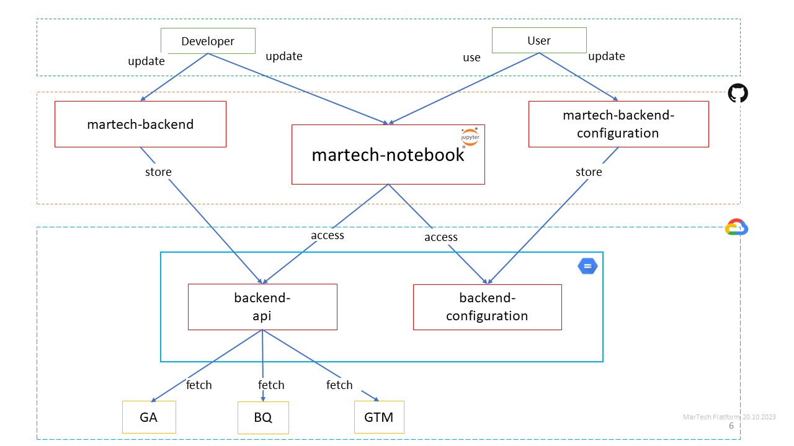

# martech-platform

## Website
[Home Page](https://storage.googleapis.com/martech-platform/index.html)

## Concept



## Quick Start

### Requirements

1) you need Python 3 or Docker to use Jupyter Notebook
* [official site](https://www.python.org/downloads/);
* [tutorial windows](https://youtu.be/yivyNCtVVDk);
* [tutorial mac](https://www.jcchouinard.com/install-python-on-macos/);
* [docker image](https://hub.docker.com/_/python);

2) you need git work with remote GitHub repositories
* [official site](https://git-scm.com/download/win)
* [tutorial windows](https://www.youtube.com/watch?v=csOnsHnbRPY)
* [tutorial mac](https://www.youtube.com/watch?v=26hzQ6KWhDM)

### Get remote repositories on your local

```
# configurate global user
git config --global user.name "John Doe"
git config --global user.email johndoe@example.com
git config --global init.default branch main

# clone repository
git clone https://github.com/katinka-bella/martech-platform.git
```

### Using Virtual Environments for Jupyter Notebook
#### Windows
```
# install python package 
pip install virtualenv

# navigate to local repository
cd martech-platform

# create virtual environment
virtualenv .venv

# activate venv
.\.venv\Scripts\activate

# install Python packages 
pip install -r requirements.txt
```

#### Mac
```
# navigate to local repository
cd martech-platform 

# create virtual environment
python -m venv .venv

# activate venv (mac)
source .venv/bin/activate

# install Python packages 
pip install -r requirements.txt
```

### Run Jupyter-Notebook / Jupyterlab

```
# run jupyter-notebook
jupyter notebook
```
### Get GCP config files on your local
1. Download from [martech-config-bucket](https://console.cloud.google.com/storage/browser/martech-config-bucket;tab=objects?forceOnBucketsSortingFiltering=true&project=katia-playground) config folder 
(martech-config-bucket > gcp)
2. Add config folder under your user in notebook sendbox

## Notebook Structure

The notebook structure is organized into two main folders: `develop` and `production`. Each folder serves a distinct purpose in the development lifecycle.

### Develop Folder

#### Sandbox

The `sandbox` directory within the `develop` folder is dedicated to individual team members. Each team member has their own folder where they can develop and test their code. This isolated environment ensures that developers can experiment freely without affecting the main codebase.

#### Marketing Platforms

Within the `develop` folder, there are subdirectories named after marketing platforms such as `google`, `adobe`, etc. These directories house functions that have been developed by individual team members. Developers place their completed functions here for discussion and collaboration before moving finished products to the `production` folder and backend functions that these products using to [the backend api reposetory](https://github.com/katinka-bella/martech-backend-api).


#### Production Folder

The `production` folder is the staging area for finalized and approved products. It is organized by marketing platforms and serves as the central repository of functional notebooks that users can leverage for their martech operations.

```
martech-platform/
├─ notebook/
│  ├─ develop/
│  |  ├─ sandbox/
│  |  |  ├─ team-member-1/
│  |  |  |  ├─ test.ipynb
│  |  |  ├─ team-member-2/
│  |  |  |  ├─ test.ipynb
│  |  |  ├─ ...
│  |  ├─ google/
│  |  |  ├─ ...
│  |  ├─ adobe/
│  |  |  ├─ ...
│  ├─ production/
│  |  ├─ google/
│  |  |  ├─ ...
│  |  ├─ adobe/
│  |  |  ├─ ...
├─ README.md
```
